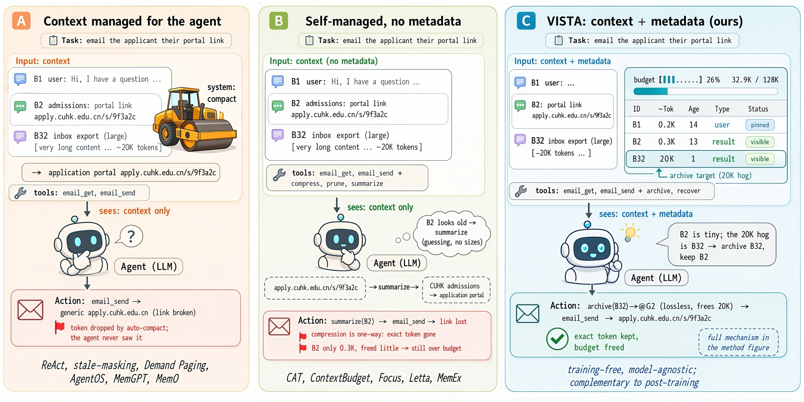

# VISTA: Self-Managed Context for Long-Horizon LLM Agents

**LLM Agents Are Latent Context Managers: Eliciting Self-Managed Context via State Proprioception**

[Paper](https://arxiv.org/abs/2606.30005) ·
[Project Page](https://binyxu.github.io/VISTA/) ·
[Data](DATA.md)



## Overview

Long-horizon tool agents are limited by how their context grows toward the
context window. VISTA gives agents a lightweight proprioceptive dashboard:
typed context blocks, per-block token and recency state, and a recoverable
archive. The method is training-free and model-agnostic.

This repository contains the VISTA implementation, benchmark integrations, and
reproducibility scripts. Large datasets and retrieval indexes are intentionally
not committed; see [DATA.md](DATA.md) for download commands.

## Repository Layout

```text
VISTA/
├── benchmarks/
│   ├── AMA-Bench/          # self-managed AMA replay integration
│   ├── BrowseComp-Plus/    # VISTA/React runner and W/B ablations
│   ├── GAIA/               # GAIA integration placeholder and scripts
│   ├── LOCAbench/          # LOCA self-managed and ablation runners
│   ├── LoCoBench-Agent/    # upstream harness, data downloaded separately
│   └── SWE-Bench/          # SWE-Bench self-managed wrapper
├── docs/                   # GitHub Pages project page
├── openclaw-context-workspace/
├── prototype/
├── analysis/
└── run_*_self_managed.sh
```

## Setup

```bash
git clone git@github.com:binyxu/VISTA.git
cd VISTA

cp .env.example .env
# edit .env with your API key and OpenAI-compatible base URL
set -a
. ./.env
set +a
```

Install benchmark-specific dependencies inside the corresponding benchmark
folder. Some upstream harnesses require Docker, Java, `uv`, or Hugging Face
credentials.

## Quick Commands

Prototype smoke test:

```bash
python3 prototype/test_context_workspace.py
```

LOCA-Bench:

```bash
bash run_loca_self_managed.sh
```

AMA-Bench:

```bash
bash run_ama_self_managed.sh
```

BrowseComp-Plus:

```bash
bash run_browsecomp_wb_sweep.sh
```

SWE-Bench:

```bash
bash run_swe_self_managed.sh
```

## Data and Indexes

Datasets and large retrieval indexes are downloaded separately to keep this
repository small. See [DATA.md](DATA.md) for:

- AMA-Bench Hugging Face dataset;
- BrowseComp-Plus corpus and prebuilt Qwen3 embedding indexes;
- SWE-Bench Hugging Face dataset;
- LoCoBench-Agent Google Drive data archive;
- GAIA data placement notes.

## Citation

```bibtex
@article{xu2026vista,
  title   = {LLM Agents Are Latent Context Managers: Eliciting Self-Managed Context via State Proprioception},
  author  = {Xu, Binyan and Li, Haitao and Zhang, Kehuan},
  journal = {arXiv preprint arXiv:2606.30005},
  year    = {2026}
}
```
