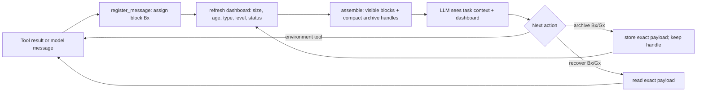

# VISTA: Visible Internal State for Tool Agents

**LLM Agents Are Latent Context Managers: Eliciting Self-Managed Context via State Proprioception**

[Paper](https://arxiv.org/abs/2606.30005) ·
[Project page](https://binyxu.github.io/VISTA/) ·
[Architecture and code map](docs/ARCHITECTURE.md) ·
[Reproduction guide](docs/REPRODUCING.md) ·
[Data](DATA.md)


VISTA is a training-free context layer for long-horizon tool agents. It turns an
append-only conversation into typed, addressable blocks; shows the model a
fresh ledger of token cost, age, type, and status; and lets the model archive
blocks without destroying the original evidence.

The key idea is **state proprioception**: the model should not have to guess
which part of its own prompt is large, stale, or already externalized.

## Where is the VISTA method?

If you only want the paper implementation, start with these four files:

| Paper component | Primary implementation | What it does |
|---|---|---|
| Context stream and workspace state | [`workspace_manager.py`](benchmarks/LOCAbench/gem/tools/mcp_server/context_workspace/workspace_manager.py) | Registers every message as a stable block, assembles the visible prompt, stores payloads, tracks block state, and enforces the workspace invariants. |
| Dashboard and budget accounting | [`workspace_manager.py`](benchmarks/LOCAbench/gem/tools/mcp_server/context_workspace/workspace_manager.py) (`update_dashboard_cache`, `_render_better_dashboard`) | Recomputes the agent-facing block ledger after each step using the same token accounting as the hard-budget checks. |
| Archive/recover meta-tools | [`server.py`](benchmarks/LOCAbench/gem/tools/mcp_server/context_workspace/server.py) | Implements block/group targeting, hierarchical archive levels, exact payload recovery, and optional irreversible deletion. |
| Online agent-loop integration | [`run_react.py`](benchmarks/LOCAbench/inference/run_react.py) | Inserts the dashboard, registers actions/results, assembles the managed prompt, handles oversized results, and gates tool calls when the hard budget is exceeded. |

These files are the deepest VISTA-specific modifications. The benchmark's task
environment and task tools are not the method; they are the surrounding
LOCA-Bench harness.

For a paper-to-code walkthrough, including the mapping from
`W_t = (V_t, A_t, P_t)` and Algorithm 1 to concrete functions, see
[`docs/ARCHITECTURE.md`](docs/ARCHITECTURE.md).

## One turn through the system



Archiving is a relocation operation, not summarization-only deletion. The
replacement text is an index for the model; the original transcript payload is
kept separately and can be read byte-for-byte later.

## What is ours, and what is upstream?

This repository intentionally includes benchmark harnesses so the published
commands are runnable. That makes ownership easy to misread:

| Area | Status | Role |
|---|---|---|
| `benchmarks/LOCAbench/gem/tools/mcp_server/context_workspace/` | **VISTA core** | Reference Python workspace, dashboard, archive, and recovery implementation used by the primary experiments. |
| `benchmarks/LOCAbench/inference/run_react.py` and `run_strict_lc*.sh` | **VISTA integration on upstream LOCA-Bench** | Connects the core to the online ReAct loop and defines the paper method/ablations. |
| `benchmarks/BrowseComp-Plus/search_agent/gemini_vista_client.py` | **VISTA adapter on upstream BrowseComp-Plus** | Reuses the LOCA core unchanged and supplies a search/get-document tool loop. |
| `benchmarks/AMA-Bench/src/method/self_managed_agentic.py` | **VISTA adapter on upstream AMA-Bench** | Replays completed trajectories into the same workspace for the paper's offline-memory transfer experiment. |
| `benchmarks/GAIA/` | **VISTA adapter** | Reuses the BrowseComp client and swaps in GAIA tools/data/scoring. |
| `benchmarks/SWE-Bench/methods/self_managed_context/` | **Experimental adapter** | A simplified SWE-Bench inference adapter; it is not the reference lossless archive/recovery implementation and is not a paper result. |
| `openclaw-context-workspace/` | **Portable JavaScript implementation** | An OpenClaw-oriented port of the workspace idea; useful for integration work, but not the implementation used for the reported Python experiments. |
| `prototype/` | **Early research prototype** | Small synthetic workspace and context-contamination experiments; useful for reading and smoke tests, not for reproducing the paper tables. |
| The remaining code inside each benchmark directory | **Upstream or lightly adapted harness code** | Environments, datasets, evaluators, and baseline infrastructure. Preserve and follow the licenses in those subdirectories. |

See [`docs/PROVENANCE.md`](docs/PROVENANCE.md) for upstream sources and a more
precise boundary between VISTA-owned code and vendored benchmark code.

## Repository layout

```text
VISTA/
├── benchmarks/
│   ├── LOCAbench/                 # reference online implementation + primary experiments
│   │   ├── gem/tools/mcp_server/context_workspace/
│   │   │   ├── workspace_manager.py   # core state, assembly, dashboard, budget
│   │   │   └── server.py              # archive/recover/delete tools
│   │   ├── inference/run_react.py     # VISTA-aware agent loop
│   │   └── run_strict_lc*.sh          # full method and ablations
│   ├── BrowseComp-Plus/           # paper transfer adapter for deep research
│   ├── GAIA/                      # paper transfer adapter for general assistance
│   ├── AMA-Bench/                 # paper offline trajectory-memory adapter
│   ├── SWE-Bench/                 # additional experimental adapter
│   └── LoCoBench-Agent/           # upstream/early integration, not the main LOCA result
├── openclaw-context-workspace/    # JavaScript port
├── prototype/                     # minimal synthetic implementation and tests
├── analysis/                      # result compaction/analysis helpers
├── docs/                          # project page plus technical documentation
├── DATA.md                        # external datasets and indexes
└── run_*_self_managed.sh          # convenience entry points
```

## Quick start

Clone the repository and load credentials for an OpenAI-compatible endpoint:

```bash
git clone https://github.com/binyxu/VISTA.git
cd VISTA
cp .env.example .env
# Edit .env, then:
set -a
. ./.env
set +a
```

Run the dependency-light prototype smoke test:

```bash
python3 prototype/test_context_workspace.py
python3 prototype/workspace_demo.py
```

This verifies the block/archive/dashboard abstraction. It does **not** reproduce
a paper benchmark. Benchmark-specific setup is described in
[`docs/REPRODUCING.md`](docs/REPRODUCING.md).

## Paper experiment entry points

| Experiment | Entry point | Implementation relation |
|---|---|---|
| LOCA-Bench main method | `bash run_loca_self_managed.sh` | Reference VISTA implementation; `SM_STRICT_LONG_CONTEXT=1`, `SM_BETTER_DASHBOARD=1`. |
| BrowseComp-Plus | `bash run_browsecomp_wb_sweep.sh` | Reuses the LOCA core in a retrieval agent. |
| GAIA | `bash benchmarks/GAIA/run_gaia_official_compare.sh` | Reuses the BrowseComp/LOCA VISTA loop with GAIA tools and scoring. |
| AMA-Bench transfer | `bash run_ama_self_managed.sh` | Agentic trajectory replay through the LOCA workspace. |
| SWE-Bench exploratory adapter | `bash run_swe_self_managed.sh` | Additional simplified adapter; not used in the paper tables. |

Large datasets and retrieval indexes are not committed. Download and placement
instructions are in [`DATA.md`](DATA.md). Exact flags, dependencies, ablation
commands, and output locations are in
[`docs/REPRODUCING.md`](docs/REPRODUCING.md).

## Extending VISTA to another agent

A new online adapter needs only four integration points:

1. Register each user/model/tool message with `WorkspaceManager.register_message`.
2. Call `update_dashboard_cache` after state changes and inject `get_dashboard`
   into the next model request.
3. Send `WorkspaceManager.assemble(messages)`, not the raw append-only history,
   to the model.
4. Expose `context_workspace_archive` and a way to read the returned payload
   path (or expose `context_workspace_recover` when the environment has no file
   tool).

The complete adapter contract and invariants are documented in
[`docs/ARCHITECTURE.md`](docs/ARCHITECTURE.md#adapter-contract).

## Citation

```bibtex
@article{xu2026vista,
  title   = {LLM Agents Are Latent Context Managers: Eliciting Self-Managed Context via State Proprioception},
  author  = {Xu, Binyan and Li, Haitao and Zhang, Kehuan},
  journal = {arXiv preprint arXiv:2606.30005},
  year    = {2026}
}
```

## Licensing note

Benchmark subdirectories retain their upstream license files. A repository-wide
license has not yet been added, so downstream users should not assume that one
benchmark's license covers the VISTA-specific code. See
[`docs/PROVENANCE.md`](docs/PROVENANCE.md#release-checklist) before redistributing
or packaging the combined repository.
