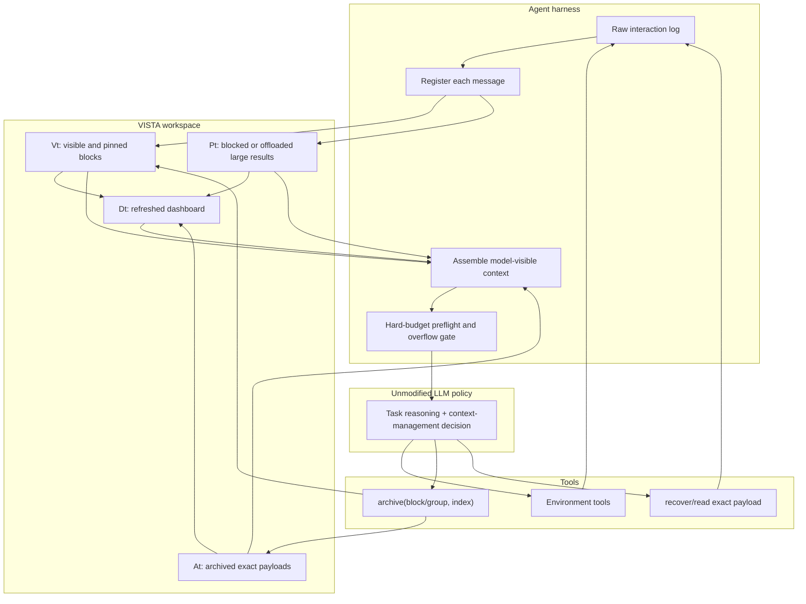
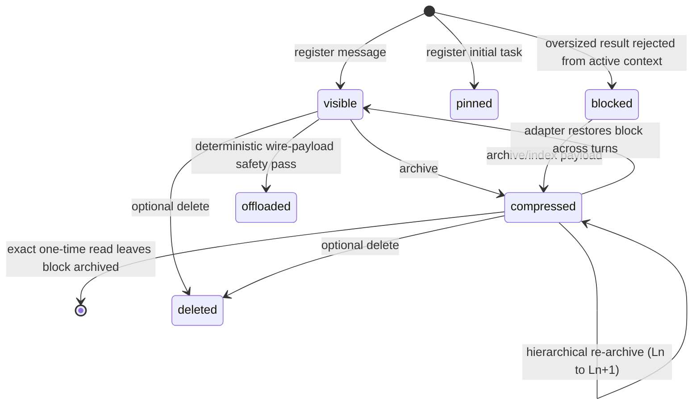

# VISTA architecture and paper-to-code map

This document identifies the reference implementation of VISTA, explains its
runtime state machine, and separates the method from benchmark-specific code.
It is written for readers who want to audit or extend the implementation rather
than only run a benchmark script.

## Scope labels

- **Core**: implements a method component described in the paper.
- **Integration**: connects the core to an agent loop without changing the task
  environment or evaluator.
- **Adapter**: carries the same method into a different benchmark interface.
- **Prototype**: an earlier or simplified implementation that is useful for
  exploration but is not the reference used for the paper result.
- **Upstream**: code inherited from a benchmark or external project.

## Runtime architecture



The raw trajectory remains available for logging and evaluation, but the model
acts on the assembled workspace rather than on the raw append-only transcript.

## Paper notation to code

| Paper object or operation | Runtime representation | Code |
|---|---|---|
| Visible blocks \(V_t\) | Blocks with `status in {visible, pinned}` | `WorkspaceManager.register_message`, `WorkspaceManager.assemble` in [`workspace_manager.py`](../benchmarks/LOCAbench/gem/tools/mcp_server/context_workspace/workspace_manager.py) |
| Archived payloads \(A_t\) | Blocks with `status == compressed`, an archive level/group, and a stored payload | `_archive_one`, `context_workspace_archive` in [`server.py`](../benchmarks/LOCAbench/gem/tools/mcp_server/context_workspace/server.py) |
| Blocked payloads \(P_t\) | Oversized tool results with `blocked`/`offloaded` state and a compact notice | `register_message(..., blocked=True)`, `preflight_offload_raw_tool_results` |
| Dashboard \(D_t\) | Cached `<context_workspace_status>` message | `update_dashboard_cache`, `get_dashboard`, `_render_better_dashboard` |
| `render(V_t)` | Protocol-valid visible messages plus archive/offload placeholders | `WorkspaceManager.assemble` |
| Stable handles | `B1`, `B2`, ... block IDs and `G1`, `G2`, ... archive groups | `register_message`, `_next_archive_group_id` |
| `archive(S, rho)` | Archive one ID, a range, a list, or a group with replacement index text | `context_workspace_archive` |
| `read(h, q)` | Exact payload file read, or explicit recovery in tool-limited adapters | `context_workspace_recover`; otherwise ordinary file/terminal reads of the returned path |
| Hard context constraint | Preflight estimation, assembly-time checks, and temporary tool gating | VISTA sections of [`run_react.py`](../benchmarks/LOCAbench/inference/run_react.py) plus `conv_tokens`/preflight in `WorkspaceManager` |

## The reference implementation

### 1. Workspace state, assembly, and dashboard

[`benchmarks/LOCAbench/gem/tools/mcp_server/context_workspace/workspace_manager.py`](../benchmarks/LOCAbench/gem/tools/mcp_server/context_workspace/workspace_manager.py)
is the primary VISTA runtime.

Its method-specific responsibilities are:

- `register_message`: converts every user, assistant, tool-call, and tool-result
  message into a typed block with a stable ID, parent relationship, token
  estimate, creation time, and status.
- `assemble`: builds the actual message list sent to the model. Visible blocks
  remain exact; archived/offloaded blocks become compact, protocol-valid
  placeholders; deleted blocks disappear.
- `conv_tokens`: counts the assembled form rather than the raw transcript. This
  prevents the dashboard and the hard-budget gate from disagreeing.
- `preflight_offload_raw_tool_results`: a deterministic safety mechanism for a
  wire payload that cannot fit. It is distinct from agent-chosen semantic
  archive and is recorded as offload state.
- `update_dashboard_cache` and `_render_better_dashboard`: expose budget usage,
  block size, age, type, hierarchy, status, and archive metadata after state
  changes.
- payload-writing helpers: keep complete archived or blocked transcripts in the
  task workspace and expose bounded manifests for very large payloads.

The class persists its state in `workspace_state.json`. Exact transcript
payloads live under `payloads/`; an agent-readable mirror or chunk manifest can
be placed in `public_payloads/`.

### 2. Context meta-tools

[`benchmarks/LOCAbench/gem/tools/mcp_server/context_workspace/server.py`](../benchmarks/LOCAbench/gem/tools/mcp_server/context_workspace/server.py)
implements the action surface seen by the model.

- `context_workspace_archive` accepts single block IDs, lists, ranges, and
  archive-group IDs. It creates hierarchical groups and increments compression
  levels while keeping the original payload.
- `context_workspace_recover` returns exact archived content in adapters where
  the agent has no ordinary file or terminal tool.
- `context_workspace_delete` is an optional irreversible ablation/action. It is
  deliberately separate from archive and protects the pinned task block.
- `context_workspace_checkpoint` and `context_workspace_update_state_board` are
  optional variants, not requirements of the full VISTA method.

The `replacement` argument is an agent-written index. It helps later navigation
but is not treated as a substitute for the preserved payload.

### 3. Online loop integration

[`benchmarks/LOCAbench/inference/run_react.py`](../benchmarks/LOCAbench/inference/run_react.py)
is an upstream LOCA-Bench runner with substantial VISTA integration. The
method-specific path:

1. Initializes one `WorkspaceManager` per task.
2. Registers the initial user message as pinned.
3. Refreshes and injects `<context_workspace_status>` before the model call.
4. Calls `assemble(messages)` to construct the request.
5. Registers the assistant action and every tool result.
6. Places oversized observations outside the active prompt with a stable block
   notice instead of silently truncating their content.
7. In strict mode, disables ordinary task tools while the request exceeds the
   budget, leaving the agent a route to archive and retry.

The environment tools and task evaluator remain LOCA-Bench components. VISTA
changes the working-memory representation and agent loop, not the task's success
condition.

## Block state machine



Names in the implementation retain some historical terminology:
`compressed` means archived behind an index/handle; it does **not** mean that
the stored payload was compressed lossily. `offloaded` is the deterministic
large-result safety path. `blocked` means the full result was never admitted to
the active prompt.

## Algorithm 1 execution trace

For a normal LOCA turn:

1. The current workspace is loaded from `workspace_state.json`.
2. The dashboard cache is refreshed after the prior tool result was registered.
3. `assemble` replaces archived members with `[ARCHIVED:Bx Ln]` or grouped
   handles while preserving message/tool protocol validity.
4. The runner counts fixed overhead, assembled conversation, dashboard, and
   output reserve against the configured budget.
5. The LLM receives the same task tools plus the context meta-tools.
6. An environment action appends a new result block. An archive action changes
   selected block state and writes the exact payload. Recovery reads that
   payload and records the access in the subsequent trajectory.
7. If strict overflow remains, ordinary environment actions are rejected until
   context management frees enough space.

This is the concrete realization of the paper's “context stream -> refreshed
dashboard -> meta context tool” loop.

## Benchmark adapters

### LOCA-Bench: reference online evaluation

- Core: `WorkspaceManager` and `server.py`.
- Integration: VISTA branches inside `inference/run_react.py`.
- Full method launcher: `run_strict_lc_better_dashboard.sh`.
- Ablations: the neighboring `run_strict_lc_no_*.sh`, fixed-policy, wording,
  and state-board launchers.

This is the best place to audit the method and the primary paper results.

### BrowseComp-Plus: same core, different environment

[`benchmarks/BrowseComp-Plus/search_agent/gemini_vista_client.py`](../benchmarks/BrowseComp-Plus/search_agent/gemini_vista_client.py)
imports the LOCA `WorkspaceManager` and context-tool server directly. It changes
the environment side to `search` and `get_document`; archive, dashboard,
assembly, and budget semantics remain shared.

Because BrowseComp agents do not necessarily have a file tool, this adapter
exposes `context_workspace_recover` explicitly. That is an interface difference,
not a change to payload fidelity.

### GAIA: reuse of the BrowseComp tool loop

[`benchmarks/GAIA/run_gaia_official_compare.sh`](../benchmarks/GAIA/run_gaia_official_compare.sh)
launches GAIA-specific tools and calls the BrowseComp VISTA client. The VISTA
core is not reimplemented in `benchmarks/GAIA/`.

### AMA-Bench: offline trajectory replay

[`benchmarks/AMA-Bench/src/method/self_managed_agentic.py`](../benchmarks/AMA-Bench/src/method/self_managed_agentic.py)
is the paper-aligned adapter. It incrementally replays a completed trajectory,
hides future questions, lets the model archive when the high-water mark is
crossed, and later renders the resulting workspace for each memory query.

`self_managed_context.py` is an earlier deterministic visibility-policy
adapter. It is useful as an engineering baseline, but it is not the agentic
replay method described in the paper's implementation section.

### SWE-Bench: simplified exploratory adapter

`benchmarks/SWE-Bench/methods/self_managed_context/strict_lc_better_dashboard.py`
splits issue context into blocks and renders a dashboard, but it does not reuse
the full LOCA state store and archive/recovery tools. Treat it as a separate
exploratory integration rather than evidence that the exact paper runtime has
already been ported to SWE-Bench.

## Other implementations

- [`prototype/context_workspace.py`](../prototype/context_workspace.py) is a
  compact Python prototype with synthetic tests. Its names (`HIDE`, `ABSTRACT`,
  `RECALL`) reflect an earlier design stage.
- [`openclaw-context-workspace/`](../openclaw-context-workspace/) is a JavaScript
  port for OpenClaw. It adds semantic archive search, scratchpad, and product
  integration features beyond the minimal paper interface.
- `benchmarks/LoCoBench-Agent/` contains an earlier/upstream long-context agent
  harness. It is not the `benchmarks/LOCAbench/` reference path used for the main
  paper table.

## Adapter contract

An online adapter is faithful to the reference design when it preserves these
invariants:

1. **Stable addressability**: every actionable message/result has a stable block
   or group handle visible to the model.
2. **Shared accounting**: the dashboard and hard-budget gate count the same
   assembled representation.
3. **Lossless externalization**: archive changes prompt visibility but preserves
   the original payload until an explicit delete.
4. **Fresh state**: the dashboard is updated after every registered result and
   before the next decision.
5. **Agent choice**: normal archive targets are selected by the agent. A
   deterministic offload path may protect the transport from an individually
   unrepresentable result, but it must be visible and recoverable.
6. **Protocol validity**: removing or replacing blocks must not leave orphaned
   tool-call/tool-result messages in the model request.
7. **Recoverability**: the agent can read exact payloads through an ordinary
   file/tool path or an explicit recovery tool.

When porting to a new framework, keep the state/assembly core separate from the
environment tools. This makes it possible to test context management without
changing the task or its evaluator.

## Generated workspace artifacts

A task workspace normally contains:

```text
context_workspace/
├── workspace_state.json      # block metadata, statuses, groups, dashboard cache
└── payloads/                 # exact internal transcript payloads

agent_workspace/
└── context_payloads/         # agent-readable payloads or bounded manifests
```

These directories are run artifacts and may contain sensitive task evidence.
Do not commit them. When sharing trajectories, sanitize payloads as well as the
visible conversation log.
